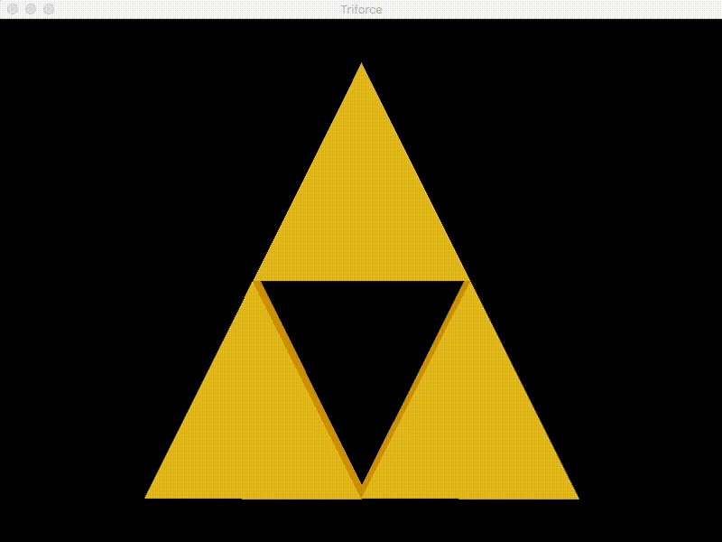

# Zelda Triforce with JOGL

Simple Zelda Triforce animation with Java Binding for the OpenGL

### Prerequisites

1. Git 2.6+
2. Maven 3+
3. Java 8+


### How to Play

Clone

```shell
git clone https://github.com/humbertodias/jogl-zelda-triforce.git
cd zelda-triforce-jogl
```

Run

```shell
mvn compile exec:java -Dexec.mainClass="jogl.zelda.triforce.Main"
```


### Output



### References

[https://jogamp.org/wiki/index.php/Maven](https://jogamp.org/wiki/index.php/Maven)

[http://www.tutorialspoint.com/jogl/](http://www.tutorialspoint.com/jogl/)
